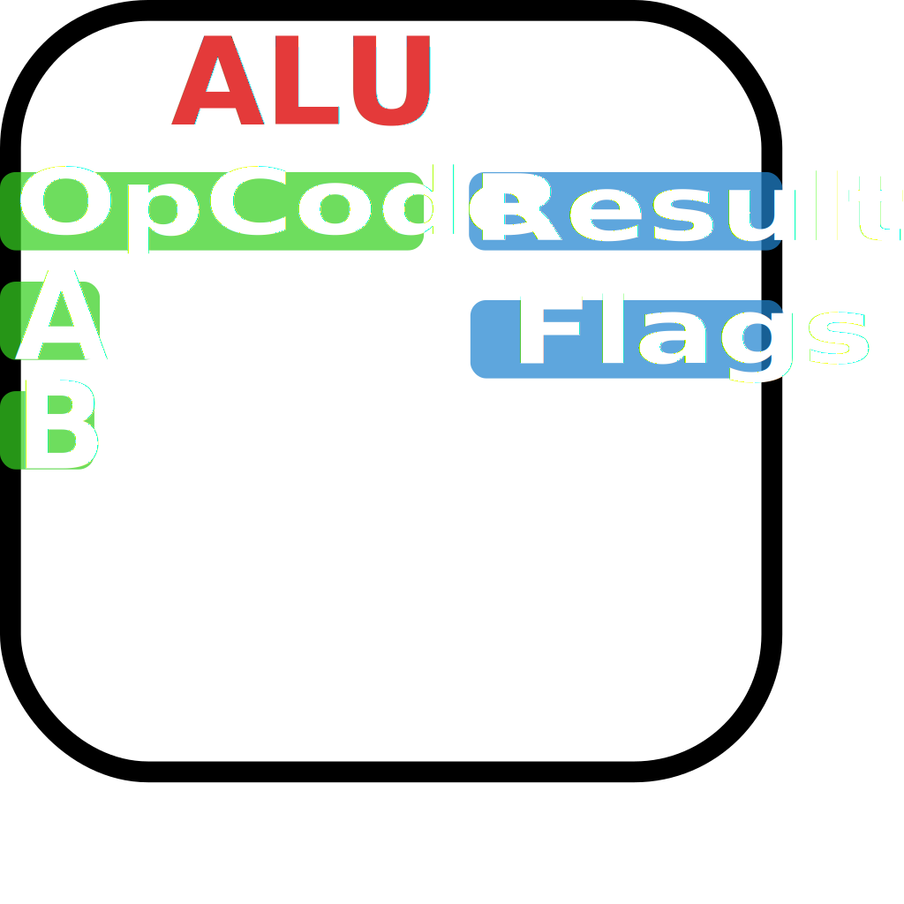

# Verilog CPU Project

This repository contains the current implementation of a modular CPU written in **Verilog**.  
The design is structured as a set of clearly defined hardware modules, each responsible for a specific architectural function.

The overall organization and execution flow are documented using the diagrams below.

---

## Architecture Overview

### Top-Level Block Diagram

The following diagram shows all implemented modules and their interconnections:

At the highest level, the CPU is composed of:
- A control path responsible for sequencing and instruction execution
- A datapath responsible for computation, storage, and data movement
- Memory interfaces for instruction and data access

---

## Execution Model

### Finite State Machine (Cycles per Instruction)

Instruction execution is controlled by a finite state machine (FSM).  
The FSM determines how many cycles each instruction takes and which control signals are asserted per cycle.

Each instruction progresses through a defined sequence of states such as:
- Instruction fetch
- Decode
- Execute
- Memory access (if required)
- Write-back (if required)

---

## Module Descriptions

Below is a description of each Verilog module currently implemented in the design.

---

### `top` (or `cpu_top`)

**Purpose:**  
Top-level integration module for the CPU.

**Responsibilities:**
- Instantiates all major submodules
- Connects datapath and control signals
- Exposes clock, reset, and external memory interfaces

---

### `control_unit`

**Purpose:**  
Generates control signals based on the current instruction and FSM state.

**Responsibilities:**
- Decodes opcodes and instruction fields
- Drives ALU control signals
- Controls register file read/write enables
- Advances FSM state

---

### `fsm_controller`

**Purpose:**  
Implements the finite state machine governing instruction execution.

**Responsibilities:**
- Tracks the current execution state
- Determines next state transitions
- Defines cycle-by-cycle behavior for each instruction

---

### `instruction_memory`

**Purpose:**  
Stores program instructions.

**Responsibilities:**
- Outputs instruction data based on the program counter
- Supports synchronous or combinational reads (depending on implementation)

---

### `program_counter`

**Purpose:**  
Holds the address of the current instruction.

**Responsibilities:**
- Increments normally during sequential execution
- Loads branch or jump targets when required
- Supports reset behavior

---

### `register_file`

**Purpose:**  
General-purpose register storage.

**Responsibilities:**
- Provides multiple read ports for operands
- Provides a write port for results
- Supports synchronous writes and asynchronous or synchronous reads

---

### `alu`

**Purpose:**  
Performs arithmetic and logical operations.

**Responsibilities:**
- Executes operations such as add, subtract, AND, OR, shifts, etc.
- Generates status flags (zero, carry, overflow if implemented)
- Operates based on control signals from the control unit

---

### `data_memory`

**Purpose:**  
Handles load and store operations.

**Responsibilities:**
- Reads data for load instructions
- Writes data for store instructions
- Interfaces with the datapath and control logic

---

### `immediate_generator`

**Purpose:**  
Extracts and formats immediate values from instructions.

**Responsibilities:**
- Sign-extends or zero-extends immediates
- Supports different instruction formats

---

### `muxes` (various)

**Purpose:**  
Select between multiple datapath sources.

**Responsibilities:**
- Choose ALU operands
- Select write-back data sources
- Control PC update paths

---

## Design Notes

- The design emphasizes **clear module boundaries** and **readable signal naming**
- Control and datapath are intentionally separated for clarity
- The FSM-based execution model makes cycle counts explicit and easy to reason about

---

## Future Work

Planned or possible extensions include:
- Pipeline implementation
- Hazard detection and forwarding
- Cache support
- Interrupt handling
- Expanded instruction set

---

## Getting Started

To simulate or synthesize the design:
1. Instantiate the `top` module
2. Provide a clock and reset
3. Load instructions into instruction memory
4. Observe execution via waveform simulation

---

## License

This project is provided for educational and experimental purposes.
